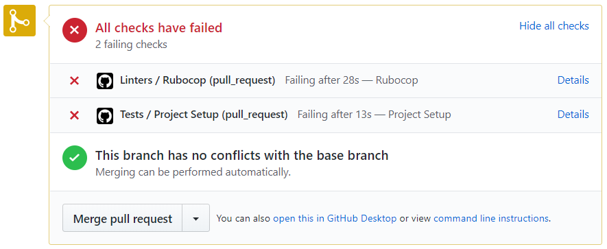
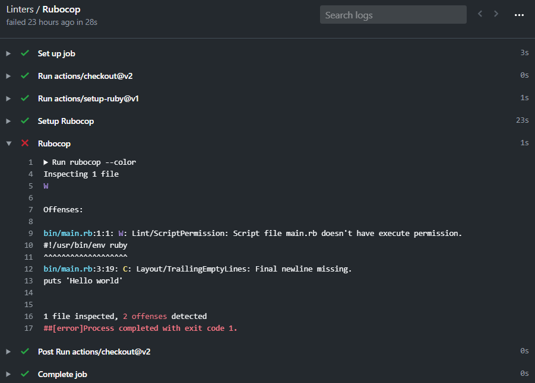

# Ruby Course

If you are not familiar with linters and Stickler, read [root level README](../README.md).

### Set-up Rubocop GitHub Action - it will show that your app is free from style errors

Please do the following **steps in this order**:

1. In the first commit of your feature branch create a `.github/workflows` folder and add a copy of [`.github/workflows/linters.yml`](.github/workflows/linters.yml) to that folder.
    - **Remember** to use the file linked above
    - **Remember** that `.github` folder starts with a dot.
2. **Do not make any changes in config files - they represent style guidelines that you share with your team - which is a group of all Microverse students.**
    - If you think that change is necessary - open a [Pull Request in this repository](../README.md#contributing) and let your code reviewer know about it.
3. When you open your first pull request you should see the result of the GitHub Actions checks:

Click on the `Details` link of each action to see the full output and the errors that need to be fixed:

### Set-up Rubocop in your local env - it will help you to find style errors

1. Add `gem 'rubocop', '~>0.81.0'` to `Gemfile` (not sure how to use Gemfile? Read [this](https://bundler.io/v1.15/guides/bundler_setup.html)).
2. Run `bundle install`.
3. Copy [.rubocop.yml](./.rubocop.yml) to the root directory of your project
4. **Do not make any changes in config files - they represent style guidelines that you share with your team - which is a group of all Microverse students.**
    - If you think that change is necessary - open a [Pull Request in this repository](../README.md#contributing) and let your code reviewer know about it.
5. Run `rubocop`.
6. Fix linter errors.
7. **IMPORTANT NOTE**: feel free to research [auto-correct options for Rubocop](https://rubocop.readthedocs.io/en/latest/auto_correct/) if you get a flood of errors but keep in mind that correcting style errors manually will help you to make a habit of writing a clean code!
